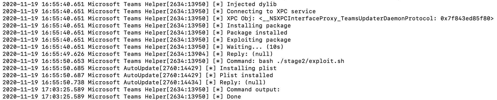
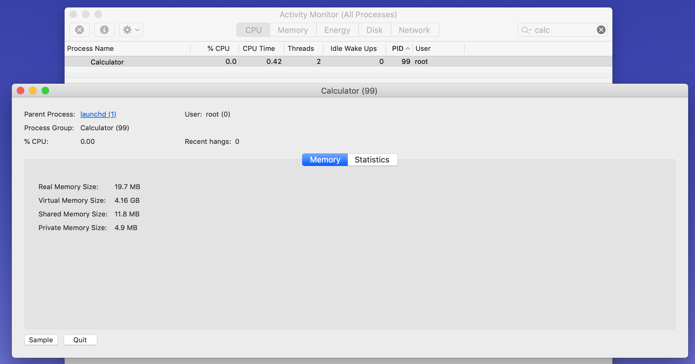

## MS Teams LPE for macOS

### Exploit Overview

Using an older version of Microsoft Teams (<=1.00.315561) it is possible to perform arbitrary dylib injection. Because older versions of Microsoft Teams do not have some of the "Hardened Runtime" features enabled like `com.apple.security.cs.disable-library-validation`, makes it possible to inject arbitrary dylibs into the application. Using an injected dylib inside of an older Microsoft Teams version, allows for the ability to interact with the Microsoft Teams XPC service of `TeamsUpdaterDaemon`. Because the `TeamsUpdaterDaemon` validates XPC connections by validating the code signing certificate and entitlements of the incoming connection process, using older versions of Microsoft Teams satisfies this requirement. Once you have the ability to interact with the `TeamsUpdaterDaemon`, it is possible to call the XPC method of `- (void)installUpdateWithPackage:(NSString *)arg1 withPreferences:(NSDictionary *)arg2 andOptions:(NSString *)arg3 withReply:(void (^)(NSString *))arg4`. This allows for the ability to install legitimate Microsoft update packages of the user's choosing. By installing an older Microsoft Update of `Microsoft_AutoUpdate_4.19.20011301_Updater.pkg`, installs a vulnerable XPC `PrivilegedHelperTool` of `com.microsoft.autoupdate.helper`. This `PrivilegedHelperTool` also validates connections via the code signing certificate and entitlements of the incoming connection process. Using an older version of `Microsoft AutoUpdate.app` and injecting an arbitrary dylib into the application, allows for the ability to connect to the `PrivilegedHelperTool`. Once connected, one can call the method of `- (void)createCloneFromApp:(NSString *)arg1 withClonePath:(NSString *)arg2 withReply:(void (^)(NSString *))arg3` that allows for the ability to perform a privileged file copy to an arbitrary location. To abuse this functionality, it is possible to copy a user defined `plist` to `/Library/LaunchDaemons/` that will execute once the system is rebooted. Once rebooted, the new `plist` will run and arbitrary code execution as root is achieved. 

### Build Steps

1. Copy an older version of Microsoft Teams (<=1.00.315561) to `msteams`
2. Run `bash ./build.sh`
3. Compress `msteams`
4. Copy to `msteams.zip` to `/tmp`
5. Run `Microsoft\ Teams.app/Contents/MacOS/Teams` from `msteams`

### Exploit Steps

1. Running the older version of Microsoft Teams will eventually call the new `libssScreenVVS2.dylib`.
2. `libssScreenVVS2.dylib` will connect to the `TeamsUpdaterDaemon` XPC service.
3. Once connected, the method `- (void)installUpdateWithPackage:(NSString *)arg1 withPreferences:(NSDictionary *)arg2 andOptions:(NSString *)arg3 withReply:(void (^)` will install the `Microsoft_AutoUpdate_4.19.20011301_Updater.pkg` located at `/tmp/msteams/stage1`.
4. Following a 10 second delay, `libssScreenVVS2.dylib` will execute the bash script located at `/tmp/msteams/stage2/exploit.sh`.
5. The following bash script will inject the `libinstallPlist.dylib` and execute an older version of `Microsoft AutoUpdate.app`.
6. The `libinstallPlist.dylib` will write the malicious plist to `/tmp/msteams/stage2/com.msteams.load.plist`. This `plist` will execute `/bin/zsh -c /Applications/Calculator.app/Contents/MacOS/Calculator` as root once rebooted.
7. `libinstallPlist.dylib` connects to the`com.microsoft.autoupdate.helper` `PrivilegedHelperTool` and the method `- (void)createCloneFromApp:(NSString *)arg1 withClonePath:(NSString *)arg2 withReply:(void (^)(NSString *))arg3` will be called. This copies the `plist` located at `/tmp/msteams/stage2/com.msteams.load.plist` to `/Library/LaunchDaemons/`
8. Once the copy is successful, a reboot will execute the new `com.msteams.load.plist` `plist` and root code execution is achieved.

### Results

### Disclosure

* Initial vulnerability [reported](https://www.offensive-security.com/offsec/microsoft-teams-macos-local-privesc/?utm_content=146366017&utm_medium=social&utm_source=twitter&hss_channel=tw-134994790) by @theevilbit 
* MSFT stated the vulnerability "did not meet the bar for servicing"
* Microsoft silently modified the `TeamsUpdaterDaemon` XPC service but failed to secure the service properly
* The latest Microsoft Teams for macOS is still vulnerable, as originally stated by @theevilbit 